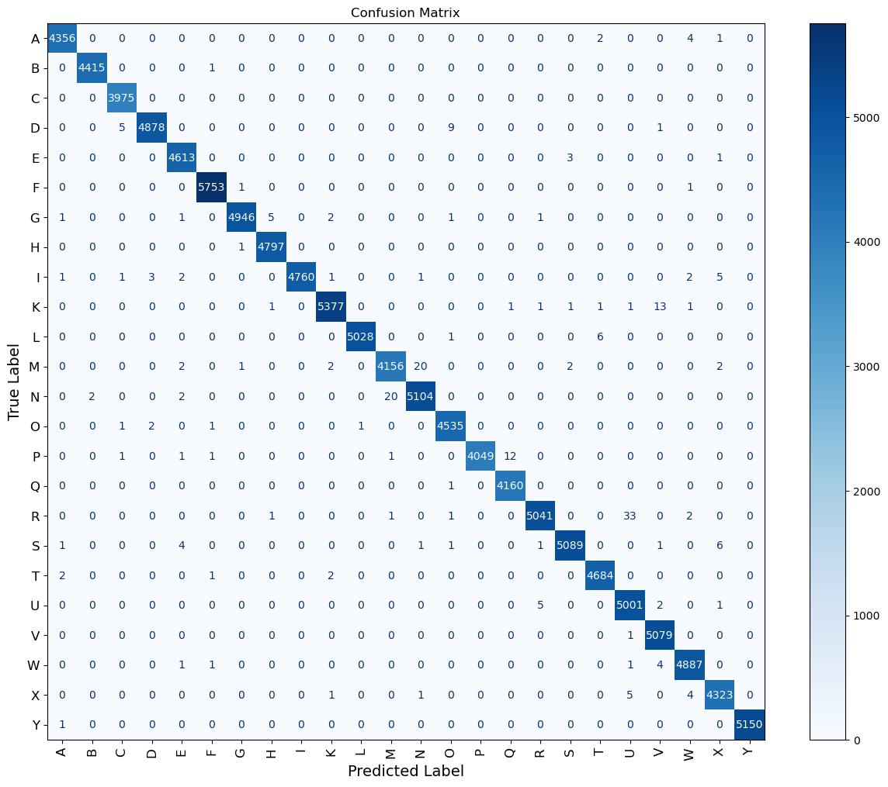
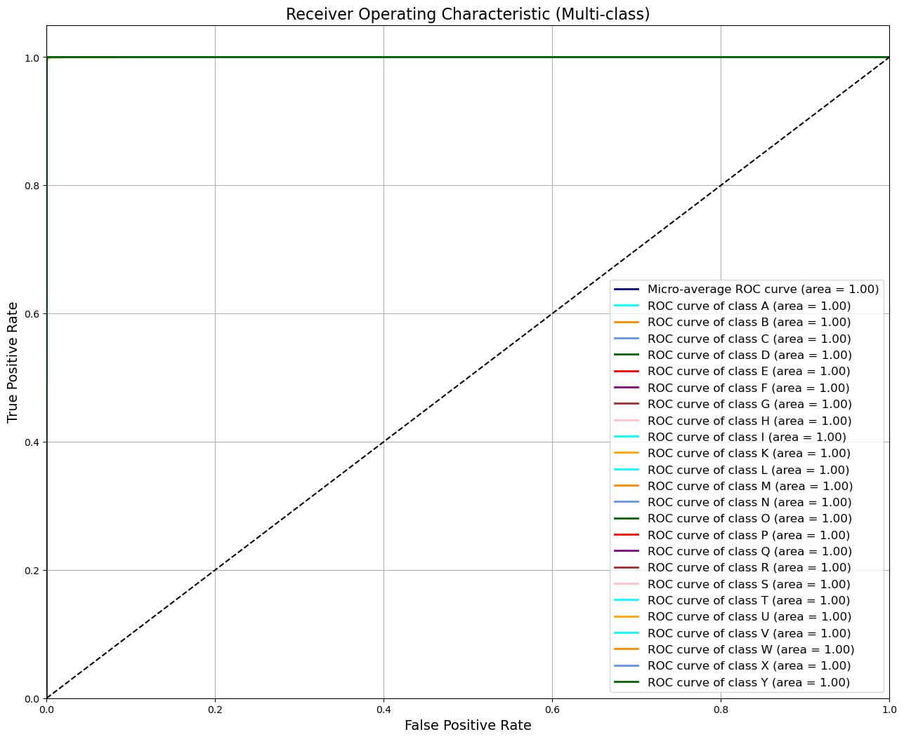

# Signing Bee

## Getting Started

Folgende python packages müssen installiert werden: `mediapipe`, `pillow`, `opencv-python`, `torch`
```bat
pip install mediapipe
pip install pillow
pip install opencv-python
pip install torch
```
`scikit-learn` (wird nur benötigt, wenn das Modell neu trainiert oder evaluiert werden soll)

```bat
pip install scikit-learn
```

## How to use
Es wird eine Webcam benötigt! Nach dem Start der Anwendung wird ein Wort aus einer vordefinierten Liste von Wörtern angezeigt. Diese müssen vor der Webcam in amerikanischer Zeichensprache (ASL) buchstabiert werden. Um Benutzern zu helfen, die nicht mit dem ASL-Alphabet vertraut sind, gibt es ein Hilfsbild in der Benutzeroberfläche, das die aktuell erforderliche Gebärde anzeigt. Für den Fall, dass ein Buchstabe mal nicht erkannt wird und man zum nächsten übergehen möchte, haben wir auch Tastaturunterstützung implementiert, so dass Buchstaben übersprungen werden können.

Navigiere zum Ordner `/src` und starte die Anwendung
```bat
cd src
python signing_bee.py
```

Application shortcuts
```
'z'   - Beendet die Anwendung
'j'   - Visualisierung der Hand Landmarks an- / ausschalten
'esc' - Vollbildmodus an- / ausschalten
```

## Exposé - Signing Bee
Frederik Busch, Marc Waclaw, Lennart Reinke

Unsere Idee ist es, ein kleines Buchstabierspiel (engl. spelling bee) zu entwickeln. Buchstabieren jedoch nicht im herkömmlichen Sinne mit der Stimme oder per Tastatureingabe, sondern mittels Sign Language.

Dem Nutzer wird ein zufälliges Wort angezeigt und zusätzlich eine Hilfestellung in Form eines Bildes, das die zugehörige Gebärde für den erwarteten Buchstaben zeigt. Mit Hilfe eines Convolutional Neural Network (CNN) erkennen wir dann die Handgeste des Nutzers und zeigen den Buchstabier-Fortschritt in der Benutzeroberfläche an. Ziel ist es, eine Applikation zu entwickeln, die es ermöglicht Sign Language zu lernen und im Zuge des Projektes herauszufinden, welche Gebärden von unserem Algorithmus gut erkannt werden und welche weniger gut.

Zum Trainieren unseres CNNs verwenden wir den *Sign Language MNIST* Datensatz. Dieser enthält etwa 35.000 28 x 28 Pixel Graustufenbilder von Gebärden des amerikanischen Sign Language Alphabets (27.455 Trainingsbilder, 7172 Testbilder). Der Datensatz schließt die Gebärden für die Buchstaben *J* und *Z* aus, weil diese im Gegensatz zu allen anderen Buchstaben Bewegung erfordern. [1] Eine sinnvolle Erkennung dieser Gebärden ist mit dem Datensatz nicht möglich. Deshalb werden auch wir in unserer Anwendung auf Wörter verzichten, die diese Buchstaben (*J*, *Z*) enthalten.

Wir werden das Projekt mit Hilfe von OpenCV, MediaPipe, PyTorch und tkinter umsetzen. OpenCV verwenden wir für die Bildverarbeitung, MediaPipe liefert nützliche Funktionen zur Hand-Detection, PyTorch nutzen wir zur Umsetzung unseres CNNs und tkinter für die Erstellung der Benutzeroberfläche. [2] [3] [4] [5]

Resources: 
* [1] Sign Language MNIST - https://www.kaggle.com/datasets/datamunge/sign-language-mnist
* [2] OpenCV - https://opencv.org/
* [3] MediaPipe - https://mediapipe.readthedocs.io/en/latest/solutions/hands.html
* [4] PyTorch - https://pytorch.org/docs/stable/index.html 
* [5] tkinter - https://docs.python.org/3/library/tkinter.html

## Neuer Datensatz
Das Projektteam hat festgestellt, dass die Ergebnisse mit dem Sign Language MNIST-Datensatz nicht den Anforderungen entsprochen haben. Die Hauptprobleme lagen in der hohen Fehleranfälligkeit bei der Erkennung und der Abhängigkeit der Erkennungsqualität von Lichtverhältnissen und Hintergrundfarbe im Webcam-Frame. Diese Schwierigkeiten können auf die Verwendung von globalen Deskriptoren, in Form von 28x28 Graustufenbildern, zurückgeführt werden. Diese Bilder bieten nur eine begrenzte Menge an Informationen für die Erkennung und unterscheiden sich möglicherweise nicht ausreichend bei variierenden Bedingungen. Auch nach mehrfacher Erweiterung des Datensatzes um eigene Aufnahmen, so wie dem Versuch die Helligkeitswerte der bestehenden Daten zu augmentieren, war das Ergebnis nicht zufriedenstellend.

Aufgrund dieser Einschränkungen haben wir uns entschieden, einen neuen Datensatz zu verwenden und das Feature von MediaPipe zur Erkennung von Hand-Landmarks einzuführen. Bei diesem Ansatz verwenden wir 21 Hand-Landmarks pro Hand, wobei jeder Landmark durch normalisierte X-, Y- und Z-Koordinaten beschrieben wird. Dieser Wechsel ermöglicht es uns, von den globalen Deskriptoren der 28x28 Graustufenbilder auf detailliertere lokale Features umzusteigen. Ein weiterer Vorteil, der sich daraus ergeben hat ist eine deutliche Verringerung der Trainingsdauer, da wir nur noch 63 Werte pro Bild lernen, anstatt der vorherigen 784 Pixel pro Bild.

**Mathematische Erklärung der lokalen Features:**

Für jede Hand werden 21 Hand-Landmarks erkannt. Jeder dieser Landmarks besteht aus 3 Koordinaten (X, Y, Z). Daher können wir die Anzahl der lokalen Features wie folgt berechnen:

- Anzahl der Hand-Landmarks pro Hand: 21
- Anzahl der Koordinaten pro Landmark: 3

Die Gesamtanzahl der lokalen Features pro Hand ist daher:

\[ \text{Gesamtanzahl der lokalen Features} = \text{Anzahl der Hand-Landmarks} \times \text{Anzahl der Koordinaten pro Landmark} \]
\[ \text{Gesamtanzahl der lokalen Features} = 21 \times 3 = 63 \]

Also besteht jede Handrepräsentation aus 63 lokalen Features (Koordinaten), die verwendet werden können, um die Handgesten zu erkennen. Dies bietet eine viel detailliertere und spezifischere Beschreibung der Handposition und -bewegung im Vergleich zu den ursprünglichen globalen Deskriptoren.

Für die Entwicklung und das Training unseres Modells haben wir zwei Datensätze verwendet:

- **Trainingsdatensatz**: [ASL (American Sign Language) Alphabet Dataset](https://www.kaggle.com/datasets/debashishsau/aslamerican-sign-language-aplhabet-dataset?select=ASL_Alphabet_Dataset), der etwa 9000 Bilder pro Buchstabe enthält.
- **Testdatensatz**: [ASL Alphabet](https://www.kaggle.com/datasets/grassknoted/asl-alphabet?select=asl_alphabet_train), der etwa 3000 Bilder pro Buchstabe umfasst.

Da beide Datensätze ausschließlich Bilddaten enthalten, wir jedoch Hand-Landmarks zur Erkennung verwenden möchten, mussten die Daten zunächst vorverarbeitet werden. Außerdem enthält der Datensatz ausschließlich rechthändische Gesten. Hierzu haben wir das Skript `data_preprocessor.py` entwickelt. Dieses Skript liest alle Bilder aus den Datensätzen ein, erstellt zusätzlich ein horizontal gespiegeltes Duplikat und nutzt dann MediaPipe zur Identifikation der Hand-Landmarks in beiden Bildern. Die erkannten Landmarks werden anschließend in eine CSV-Datei geschrieben, wobei das zugehörige Label in der ersten Spalte als Präfix angegeben wird. Weil nicht bei jedem Bild Hand-Landmarks erkannt werden konnten, reduzierte sich die Datenmenge der Originalbilder im Vorverarbeitungsprozess, da wir aber jedes Bild noch einmal horizontal gespiegelt haben ist die Gesamtmenge der Datenpunkte am Ende größer geworden als im ursprünglichen Datensatz. Der finale Trainingsdatensatz enthält nun insgesamt 281897 Datenpunkte, im Durchschnitt 11745 Datenpunkte pro Buchstabe. Der finale Testdatensatz enthält insgesamt 114402 Datenpunkte und weist im Durchschnitt 4766 Datenpunkte pro Buchstabe auf. Diese Menge übertrifft deutlich die Anzahl der Datenpunkte im Sign Language MNIST-Datensatz, der im Durchschnitt nur 1145 Datenpunkte pro Buchstabe bereitstellte. Ein Nachteil dieses Vorverarbeitungsschrittes ist, das er ziemlich lange dauert. Für den gesamten Bilddatensatz dauert es in etwa drei Stunden auf einem Macbook Air 2020 M1. Dafür ist wie zuvor bereits erwähnt das Training deutlich schneller aufgrund der verringerten Datenpunkte pro Bild.

Um sicherzustellen, dass die Trainingsdaten gleichmäßig verteilt sind, implementierten wir das Skript `label_counter.py`, das die Gesamtanzahl der Datenpunkte pro Label ermittelt. Es stellte sich heraus, dass die Buchstaben M und N nach der Vorverarbeitung signifikant weniger Datenpunkte aufwiesen als der Durchschnitt, mit lediglich 8017 (M) bzw. 8432 (N) Datenpunkten. Zur Balance des Trainingsdatensatzes wurden diese Buchstaben durch Duplizieren von Datenpunkten aufgestockt, um sicherzustellen, dass für jeden Buchstaben mindestens 11000 Datenpunkte vorhanden sind.

### Architektur des HandGestureMLP-Modells
Wir haben uns, anders als im Kapitel `Idee` beschrieben, gegen ein Convolutional Neural Network entschieden und stattdessen eine Multilayered Perceptron Architektur umgesetzt. Ein MLP eignet sich gut für die Hand Landmark Daten, da diese tabellarisch vorliegen und keine räumlichen Beziehungen wie bei Bilddaten enthalten, die CNNs nutzen könnten. MLPs können effizienter mit solchen flachen Daten arbeiten, da sie auf die direkte Verarbeitung numerischer Merkmale ausgelegt sind. CNNs hingegen sind für Bildverarbeitung optimiert und ihre Faltungsoperationen sind für bereits extrahierte Landmark-Koordinaten unnötig. Daher führt die einfachere Struktur von MLPs zu schnellerem Training und besserer Anpassung bei diesem Anwendungsfall.

#### 1. **Input Layer:**
   - **`input_size=63`**: Das Input Layer erwartet einen Eingabefeature-Vektor mit 63 Merkmalen. Diese Merkmale stammen aus den vorverarbeiteten Handlandmark-Daten. Jeder Vektor stellt die Merkmale eines Handbildes oder einer Handgeste dar, wobei jedes Merkmal die Position eines bestimmten Punktes auf der Hand repräsentiert.

#### 2. **Hidden Layers:**
   - **`fc1`**: Das erste hidden Layer (`fc1`) ist ein vollverbundenes Layer (`nn.Linear(input_size, hidden_size)`). Es hat 128 Neuronen (`hidden_size`) und ist für die Umwandlung der Eingabefeatures in eine höherdimensionale Repräsentation verantwortlich.
     - **Aktivierungsfunktion**: Nach der Linearen Transformation wird die ReLU-Aktivierungsfunktion (`F.relu`) angewendet, die nicht-lineare Beziehungen in den Daten modellieren kann.
     
   - **`fc2`**: Das zweite hidden Layer (`fc2`) ist ebenfalls ein vollverbundenes Layer, das die Ausgabe des ersten hideen Layer auf eine weitere höhere Dimension transformiert, wieder mit 128 Neuronen.
     - **Aktivierungsfunktion**: Auch hier wird die ReLU-Aktivierungsfunktion verwendet, um nicht-lineare Beziehungen zu modellieren.

#### 3. **Output Layer:**
   - **`fc3`**: Das Output Layer (`fc3`) ist ein vollverbundenes Layer, der die Ausgabe des letzten hidden Layer in eine Dimension von `num_classes` transformiert, was der Anzahl der verschiedenen Klassen entspricht, die im Handgestenerkennungssystem unterschieden werden sollen (in diesem Fall 24 Klassen).
     - **Aktivierungsfunktion**: Im Output Layer wird keine Aktivierungsfunktion angewendet. Stattdessen gibt das Layer Rohwerte oder Logits aus, die später in der Verlustberechnung durch die Softmax-Funktion (implizit in der Crossentropy-Verlustfunktion) in Wahrscheinlichkeiten umgewandelt werden.

#### 4. **Zusammenfassung des Modells:**
   - **Modelltyp**: Multilayered Perceptron (MLP)
   - **Architektur**:
     - **Input**: 63 Features
     - **Hidden Layer 1**: 128 Neuronen, ReLU-Aktivierung
     - **Hidden Layer 2**: 128 Neuronen, ReLU-Aktivierung
     - **Output**: `num_classes` (24 Klassen)
   - **Gesamtzahl der Parameter**:
     - Die Anzahl der Parameter kann durch die Formel für fully-connected Layer berechnet werden: \( \text{Parameter} = (\text{Eingangsgröße} \times \text{Ausgangsgröße}) + \text{Ausgangsgröße} \).
     - Für `fc1`: \( (63 \times 128) + 128 = 8128 \)
     - Für `fc2`: \( (128 \times 128) + 128 = 16512 \)
     - Für `fc3`: \( (128 \times 24) + 24 = 3104 \)
     - Insgesamt: \( 8128 + 16512 + 3104 = 27844 \) Parameter

### Modell Training und Evaluation

- **Training**:
  - Der Trainingsprozess verwendet die Crossentropy-Verlustfunktion (`nn.CrossEntropyLoss`) und den Adam-Optimierer (`optim.Adam`). Der Optimierer aktualisiert die Modellparameter basierend auf dem Gradienten des Verlusts, der durch Backpropagation berechnet wird. Das Modell wurde über 200 Epochen hinweg trainiert, um eine optimale Anpassung an die Daten zu erreichen.

- **Evaluation**:
  - Die Leistung des Modells wird während des Trainings auf einem Validierungsdatensatz bewertet, um die Genauigkeit des Modells zu überwachen und Überanpassung (Overfitting) zu verhindern. Hierfür wird während dem Trainingsprozess der Trainingsdatensatz im Verhältnis 80 (train) zu 20 (val) aufgeteilt. Außerdem gibt es noch ein zusätzliches Skript `metrics.py`, welches weitere Metriken zur Evaluierung unseres Modells berechnet auf Grundlage des im Kapitel zuvor beschriebenen Testdatensatzes: `Accuracy`, `Precision`, `Recall`, `F1-Score`, `Confusion Matrix` und `ROC_AUC Curve`

## Ergebnisse

* Accuracy: **99,79%**  
* Precision: **99,78%**
* Recall: **99,79%**
* F1-Score: **99,79%**

Im folgenden haben wir zwei Diagramme, die die vorangestellten Werte kontextualisieren sollen. 

### Confusion Matrix


Wie anhand der Werte zu erkennen ist, ist die Rate der TP extrem hoch und die theoretische Leistung des Models sehr gut. Die Matrix zeigt allerdings ein paar interessante Fälle auf, die in den Werten nicht zu erkennen sind. Beispielsweise die Fälle in denen das K fälschlicherweise als V (13 Fälle), das R als U (33 Fälle), das P als Q (12 Fälle) und das D als U (9 Fälle) klassifiziert wurden, stechen hierbei heraus. Während die Fälle K-V, R-U und D-U auf die hohe Ähnlichkeit der Gesten zurückzuführen ist, ist der Fall P-Q nicht ganz so eindeutig, da sich diese beiden Gesten doch deutlich unterscheiden.
Ebenfalls auffällig ist die Diskrepanz zwischen der Anzahl der TPs im Verhältnis zu der Gesamtanzahl bei einigen Labels. Gerade die TP-Rate von M und N, sowie C sind auffällig im Vergleich zum Rest. Während M und N sich wieder mit der Ähnlichkeit der Gesten zueinander erklären lassen, ist die Diskrepanz bei C nicht eindeutig, da diese Geste sich eigentlich gut vom Rest unterscheiden lässt.

### ROC_AUC Curve



### Ergebnisse Sign Language MNIST
Zum Vergleich sind hier noch einmal die Ergebnisse des ersten Modells, welches mit dem Sign Language MNIST trainiert wurde:
* Accuracy: **95,73%**
* Precision: **95,70%**
* Recall: **95,31%**
* F1-Score: **95,28%**

Diese Werte scheinen auch recht hoch, bei der tatsächlichen Erkennung der Gebärden haben sie sich jedoch nicht bewährt. Hier wurden viele Buchstaben, wie zuvor bereits erwähnt nur schwer erkannt und bei geringsten Veränderungen der Umgebungsverhältnisse wurde die Erkennung teilweise nahezu unmöglich. Das die Werte dennoch so *gut* ausgefallen sind hängt vermutlich damit zusammen, dass der Testdatensatz beim Sign Language MNIST bei sehr ähnlichen Lichtverhältnissen und Hintergrundbedingungen aufgenommen wurde, wie der Trainingsdatensatz, was dazuführt, das bei der Evaluierung die zuvor genannten Probleme nicht auffallen.

## Related Work

Unsere Anwendung zur Gebärdenspracherkennung baut auf bewährten Methoden auf, die sich mit der Erkennung von Handgesten und Fingerspelling beschäftigen. Zwei zentrale Arbeiten haben uns dabei inspiriert und bieten einen guten Vergleich zu unserem Ansatz.

In der Studie von **[1]Byeongkeun Kang et al. (2015)** wird ein System vorgestellt, das mithilfe von Convolutional Neural Networks (CNNs) und Tiefenbildern das ASL-Fingerspelling-Alphabet in Echtzeit erkennt. Durch die Verwendung von Depth Maps können sie die Position und Tiefe der Hand präzise erfassen, was das System robuster gegenüber variierenden Lichtverhältnissen und Hautfarben macht. Das Resultat ist eine beeindruckende Erkennungsgenauigkeit von 99,99% bei bekannten Nutzern und bis zu 85,49% bei neuen Nutzern. Besonders interessant ist, dass sie durch das Hinzufügen von Daten verschiedener Nutzer die Leistung des Systems weiter steigern konnten, was die Bedeutung eines vielfältigen Trainingsdatensatzes unterstreicht.

Im Gegensatz dazu beschreibt das Paper von **[2]Fan Zhang et al. (2020)** die Entwicklung von MediaPipe Hands, einem flexiblen Framework zur Echtzeit-Handverfolgung. MediaPipe nutzt eine zweistufige Erkennung: Zuerst wird die Handfläche durch einen schnellen Palm-Detektor erkannt, danach werden 21 Hand-Landmarks wie Gelenke und Fingerspitzen mithilfe eines trainierten neuronalen Netzwerks erfasst. Diese Methode funktioniert zuverlässig auf einer Vielzahl von Geräten, von Smartphones bis hin zu Webcams, und kommt ohne spezialisierte Hardware wie Tiefensensoren aus.

Zhang und sein Team zeigen in ihrem Paper, wie MediaPipe durch geschickte Modellarchitekturen und Optimierungen eine schnelle und präzise Handverfolgung ermöglicht. Obwohl sie keine genauen Genauigkeitswerte für Fingerspelling angeben, unterstreicht das System seine Robustheit in verschiedenen Szenarien. MediaPipe ist damit eine vielseitige und effiziente Lösung, die sich besonders für Echtzeitanwendungen wie unsere eignet.

Beide Ansätze haben das gleiche Ziel – eine zuverlässige Gebärdenspracherkennung –, verfolgen jedoch unterschiedliche Wege, um dies zu erreichen. Während Kang und sein Team auf spezialisierte Hardware setzen, liegt unser Fokus auf einer zugänglicheren und flexibleren Lösung, die auf einer breiteren Palette von Geräten funktioniert. Beide Ansätze bieten wertvolle Einblicke in die Herausforderungen und Möglichkeiten der Gebärdenspracherkennung.

[1][Byeongkeun Kang et al. (2015)](https://arxiv.org/pdf/1509.03001) - Real-time Sign Language Fingerspelling Recognition using
Convolutional Neural Networks from Depth map (University of California, San Diego)

[2][Fan Zhang et al. (2020)](https://arxiv.org/pdf/2006.10214) - MediaPipe Hands: On-device Real-time Hand Tracking (Google Research Team)


## Download Links

* [Google Drive](https://drive.google.com/file/d/1GXR1OaFz8m6Fr7Jr_kn6Rcu5YOq5W-Jz/view?usp=sharing) - Vorverarbeitete Hand Landmark Datenpunkte (Training / Test)

* [ASL (American Sign Language) Alphabet Dataset](https://www.kaggle.com/datasets/debashishsau/aslamerican-sign-language-aplhabet-dataset?select=ASL_Alphabet_Dataset) - Trainingsbilder

* [ASL Alphabet](https://www.kaggle.com/datasets/grassknoted/asl-alphabet?select=asl_alphabet_train) - Testbilder
